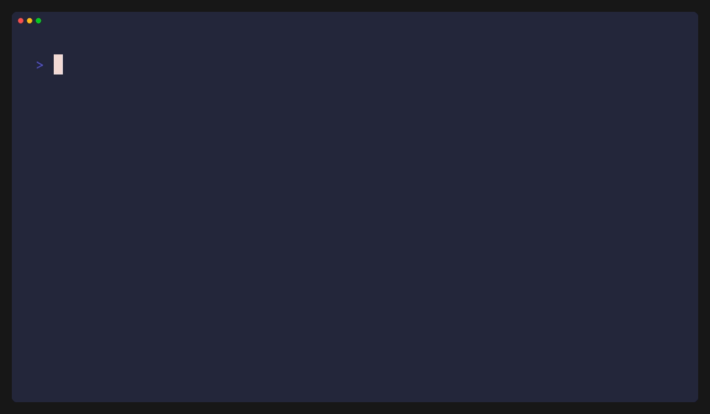

<div align="center">
  
# 🚀 JOTUN (v0.4.0)

**The lightning-fast, terminal-native personal knowledge base. Capture at the speed of thought. Organize with hierarchical power.**

<p align="center">
  <a href="LICENSE"></a>
  <a href="https://github.com/dev-Aatif/jot/releases"></a>
  <a href="https://github.com/dev-Aatif/jot/actions"></a>
  <a href="https://github.com/dev-Aatif/jot/stargazers"></a>
</p>

<p align="center">
  <a href="#🧠-usage"><strong>Explore the Docs »</strong></a>
  <br>
  <br>
  <a href="./ROADMAP.md"><strong>View Roadmap »</strong></a> ·
  <a href="https://github.com/dev-Aatif/jot/issues">Report Bug</a> ·
  <a href="https://github.com/dev-Aatif/jot/issues">Request Feature</a>
</p>

<p align="center">
  
</p>
</div>

---

## 🆕 New in v0.4.0: Insights & Visual Analytics
v0.4.0 introduces the **Jotun Intelligence Suite**, giving you deep visibility into your knowledge base.

- **Insights Dashboard**: A new full-screen dashboard in the TUI (press `i`) with Htop-style gauges for source distribution and a "process list" for recent notes.
- **Penguin Stats CLI**: A beautiful Neofetch-style `jot stats` command with Penguin ASCII art and system metadata.
- **Dracula Theme Engine**: The default look has been upgraded to the premium Dracula palette.
- **Performance Tuning**: Optimized database queries for lightning-fast stats aggregation.

---

## 📅 New in v0.3.0: Hierarchical Knowledge & Performance
v0.3.0 transformed Jotun from a simple note-taker into a structured personal knowledge base.

- **Hierarchical Tagging**: Organize notes with nested paths (e.g., `work/project-a`, `personal/finance`).
- **Three-Pane Dashboard**: High-efficiency TUI with a dedicated Tags Sidebar and Note Navigator.

---

## 🚀 Performance: The Weight Class
Jotun is engineered for systems where every megabyte counts. It lives in your RAM like it's not even there.

| Editor | Platform | RAM Usage (Idle) |
| :--- | :--- | :--- |
| **Jotun** | **CLI/TUI** | **< 10 MB** |
| Neovim / Vim | CLI | 20 MB - 70 MB |
| Obsidian | GUI (Electron) | 400 MB - 900 MB |
| VS Code | GUI (Electron) | 600 MB - 1.5 GB |
| Logseq | GUI (Electron) | 500 MB - 1 GB |

---

## ✨ Features

- **Lightning Fast**: Built in Pure Rust with a SQLite FTS5 backend.
- **Metadata Aware**: Automatically tracks `source`, `created`, and `updated` timestamps.
- **Clipboard Native**: First-class support for Wayland (`wl-copy`) and X11 (`xclip`).
- **Local First**: Your data stays on your machine. Always.
- **Minimalist**: 100% terminal focused. No bloat, no unnecessary UI.

---

## 🧠 Usage

### CLI Power-User Commands
```bash
# Create a note with metadata
jotun new "Fix login bug" --title "Auth Fix" -t work/jotun -t critical

# List notes in a specific tag hierarchy
jotun ls --tag work

# View all unique tags
jotun tags
```

### Subcommands Reference
| Command | Action |
| :--- | :--- |
| `jotun dash` | Launch the **Three-Pane Interactive Dashboard**. |
| `jotun new [text]` | Save a note (reads from stdin if text is missing). |
| `jotun ls [-t tag]` | List notes with hierarchical tag filtering. |
| `jotun tags` | Display all unique tags in a tree-like list. |
| `jotun show [id]` | Full note display with complete metadata. |
| `jotun find [query]` | Global FTS5 full-text search across titles and bodies. |
| `jotun stats` | View **Neofetch-style analytics** and knowledge insights. |

---

## ⚙️ Configuration

Jotun creates a default configuration file at `~/.config/jotun/config.toml` on its first run.

```toml
editor = "nvim"                # Your preferred system editor
syntax_highlighting = true     # Toggle Markdown highlighting in TUI

[theme]
active_border = "#bd93f9"       # Dracula Purple
highlight_bg = "#44475a"        # Dracula Selection
highlight_fg = "#f8f8f2"        # Dracula Foreground
```

---

## 🛣 Roadmap

Jotun has an ambitious path ahead. From visual insights to full encryption and sync.

👉 **[View the full Roadmap here](./ROADMAP.md)**

---

## 📄 License

Distributed under the **MIT License**. See `LICENSE` for more information.
